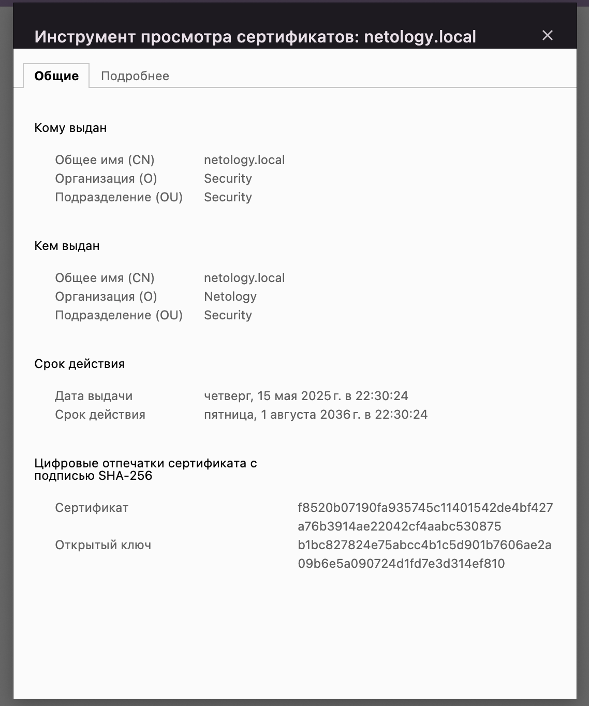

## Домашнее задание к занятию «Механизмы идентификации, аутентификации, авторизации и безопасного хранения данных о пользователях»

### Задание аутентификация по сертификатам X.509

Решение задания

[Файлы ca.crt, client.pfx, server.crt.](./certs/)
