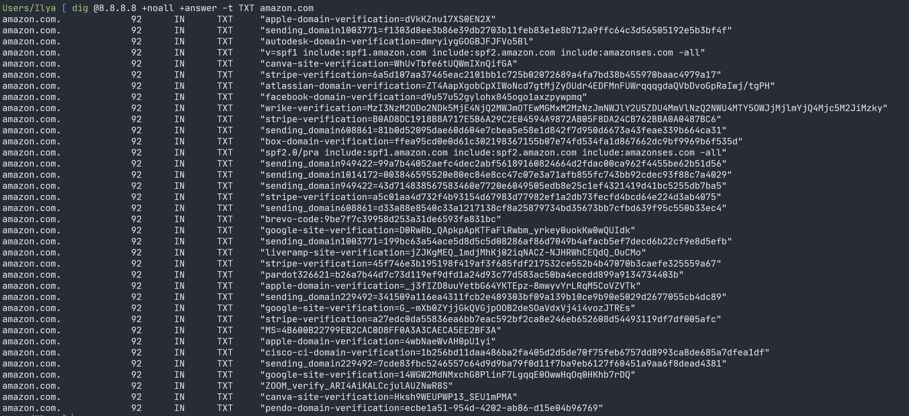
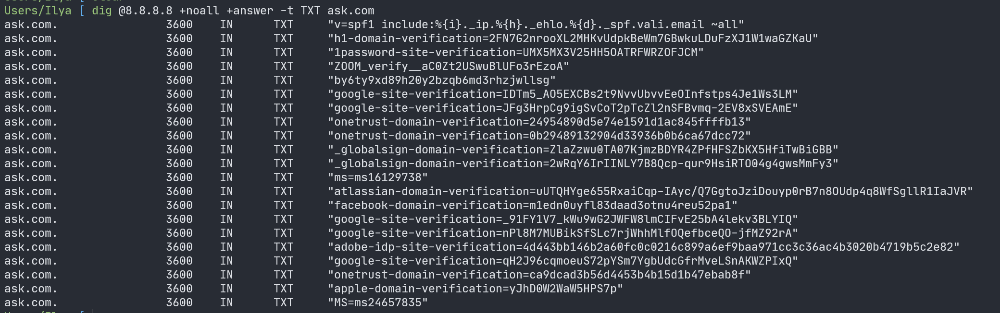
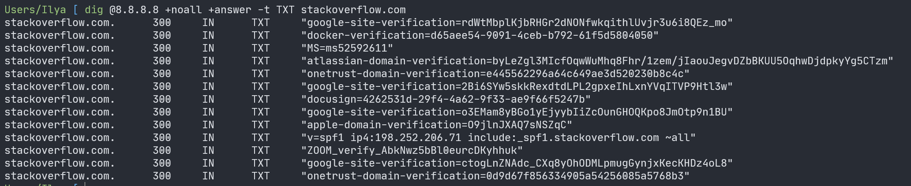
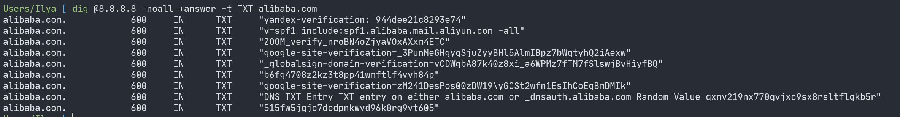
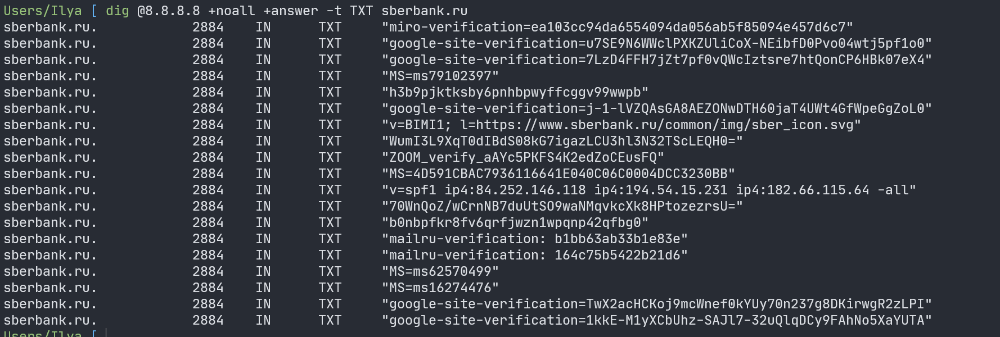

# Домашнее задание к занятию «Работа сети Интернет (часть 1): BGP, DNS»

### ZOOM

Использовал сайты крупнейших компаний

1. amazon.com

2. ask.com

3. stackoverflow.com

4. alibaba.com

5. sberbank.ru

### BGP

[файл проекта BGP.pkt](./assets/BGP.pkt)