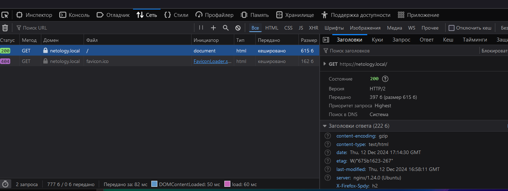
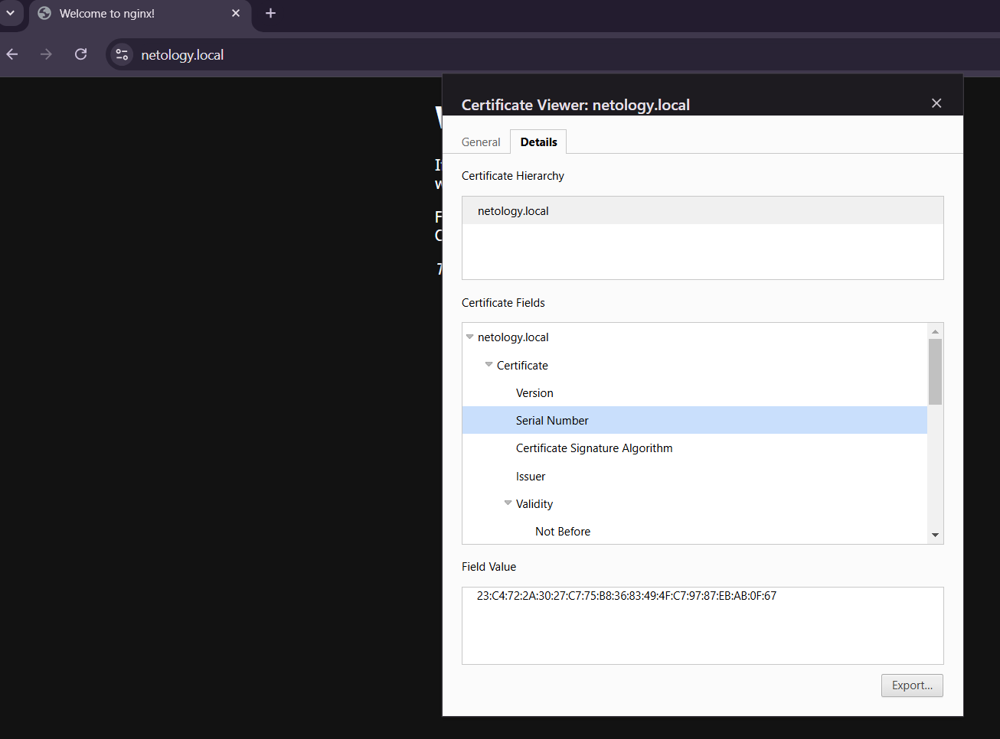

# Домашнее задание к занятию «Работа сети Интернет (часть 2): HTTP, HTTPS, HTTP2»

1. сертификат
[сертификат](./assets/netology.download.crt)

2. страница загружается по HTTP2

3. скриншот серийного номера сертификата при просмотре в браузере

